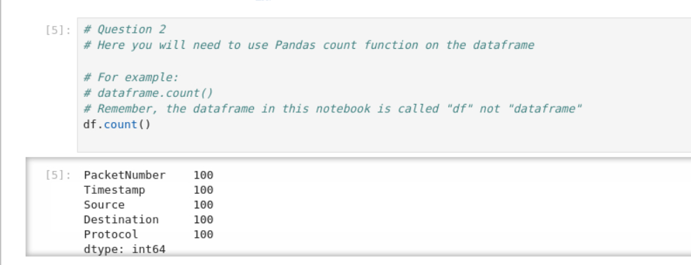
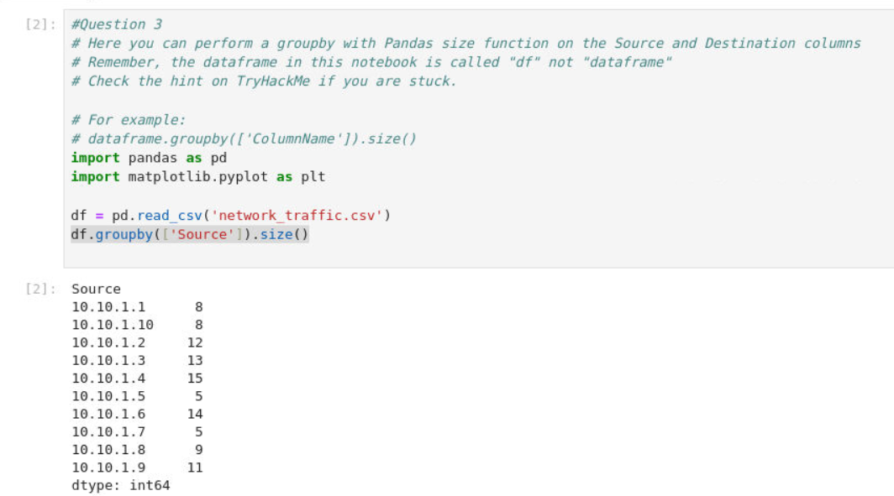
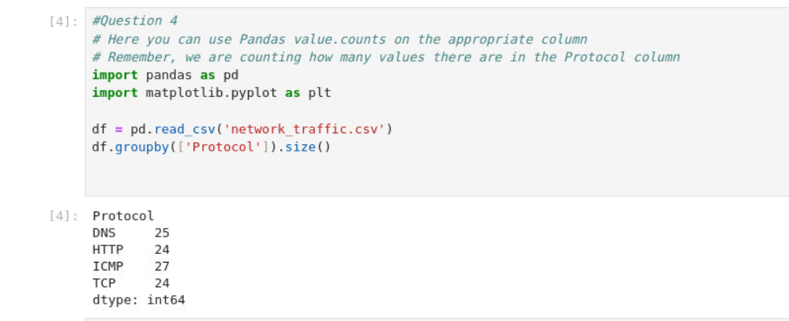

## Task 1: How many packets were captured (looking at the PacketNumber)?

Command: df.count()

Answer: 100

## Task 2: What IP address sent the most amount of traffic during the packet capture?

Command: df.groupby(['Source']).size()

Answer: 10.10.1.4 (Highest with 15)

## Task 3: What was the most frequent protocol?

Command: df.groupby(['Protocol']).size()

Answer: ICMP (Highest with 27)

