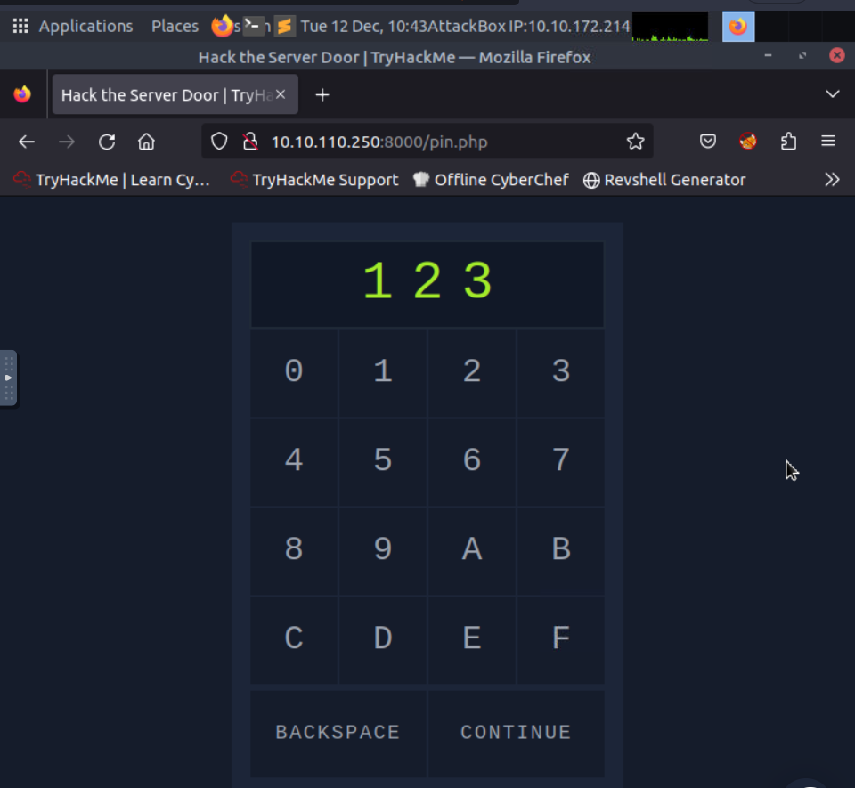
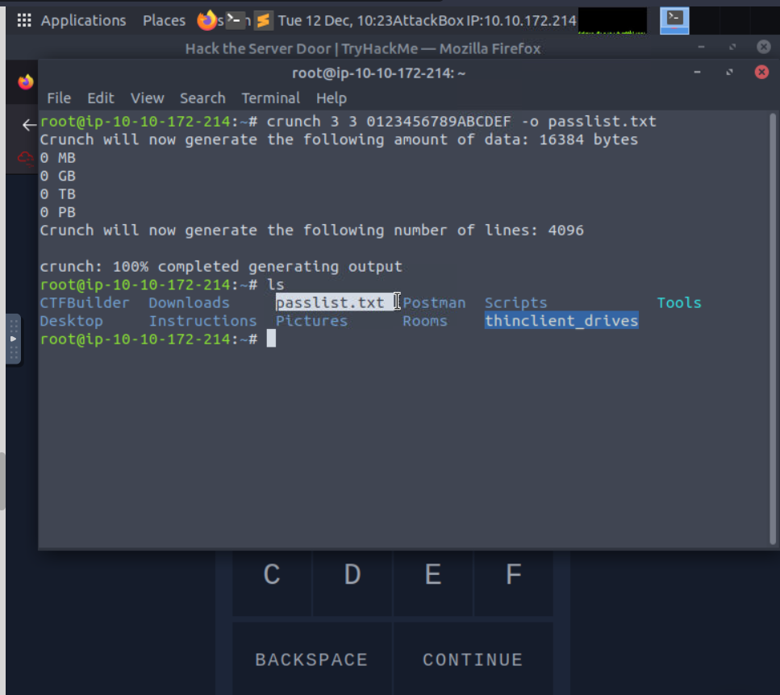
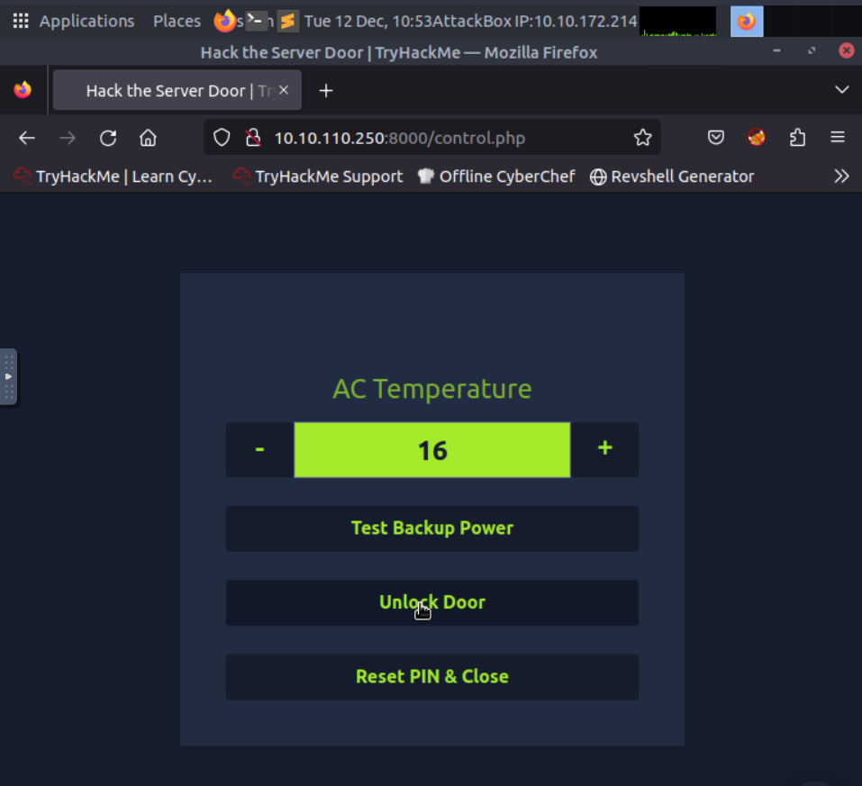
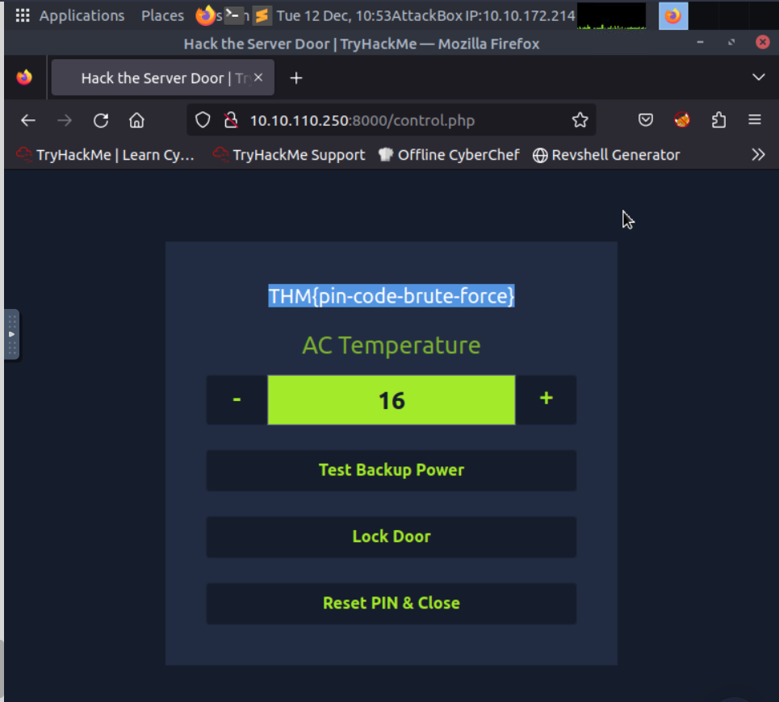

# Challenge: Bruteforcing a password 

## Task 1: Creating a password list uding "Crunch"

Crunch is a tool that generates a list of all possible password combinations based on given criteria.

crunch min max [options] [charset]

Where:

min: This is the minimum length of the strings to be generated.

max: This is the maximum length of the strings to be generated.
Optional Parameters:

[options]: These are various options that can modify the behavior of Crunch, like setting the output file, pattern, or specifying the number of lines to generate.

[charset]: This is where you can define a custom character set. If not provided, Crunch uses the default character set.

In our challenge, the passwprd should be 3 characters long

The command I used is: 

crunch 3 3 0123456789ABCDEF -o passlist.txt

A total of 4096 passwords were generated i.e. 16x16x16

## Task 2: Brute forcing the password using 'Hydra'

hydra -l '' -P passlist.txt -f -v 10.10.110.250 http-post-form "/login.php:pin=^PASS^:Access denied" -s 8000

The command above will try one password after another in the 3digits.txt file. It specifies the following:

-l '' indicates that the login name is blank as the security lock only requires a password

-P 3digits.txt specifies the password file to use

-f stops Hydra after finding a working password

-v provides verbose output and is helpful for catching errors

10.10.110.250 is the IP address of the target

http-post-form specifies the HTTP method to use

"/login.php:pin=^PASS^:Access denied" has three parts separated by :

/login.php is the page where the PIN code is submitted

pin=^PASS^ will replace ^PASS^ with values from the password list

Access denied indicates that invalid passwords will lead to a page that contains the text “Access denied”

-s 8000 indicates the port number on the target

I found the password as '6F5' and used it to unlock the door and find the flag 'THM{pin-code-brute-force}'

